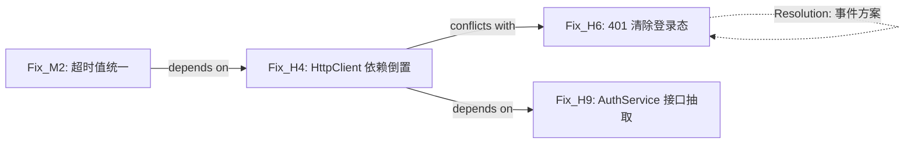

# Fix Planning & Coordination（修复规划与协调）

> **针对"修复方案间冲突"（如 H6 与 H4 打架）的结构化约束。**
> 本文件定义三层机制，把隐性冲突变成显性、可核验的规则：
> ① 机制层：Fix Dependency Graph（修复依赖/冲突图）
> ② 流程层：诊断与规划分离（两阶段产出）
> ③ 形式化层：修复条目 DSL（Preconditions / Postconditions / Side_Effects）
>
> **术语**：本文的"诊断/规划"指**产出时序**；与 SKILL.md 的 Stage 1/Stage 2（审查深度）是不同维度，勿混用。

---

## 适用时机（MANDATORY 判定）

报告含 **≥3 个修复建议**，或任意两个修复可能触及**同一模块/同一文件/同一状态**时，
必须启用本流程。判定规则：发现以下任一字眼即视为可能冲突——

- 两个修复都提到同一服务类/封装类（HttpClient、AuthService、Repository…）
- 一个修复"增加依赖"，另一个"消除依赖"（方向相反）
- 一个修复要求调用某模块，另一个要求该模块重构/下线

**单一文件、彼此独立的修复**（互不触及同一目标）不强制启用，但 DSL 字段仍建议填写。

---

## 流程层：两阶段产出（Diagnosis → Planning）

### 阶段一：问题诊断报告（Diagnosis Report）

**内容：仅列出问题清单** —— Critical / High / Medium，每条附带：

```text
[ID] 严重度 — 一句话问题描述
      证据: 文件:行号 + 关键代码片段引用（不改写）
      影响: 用户可感知的功能后果（定级依据）
```

**禁止**：任何修复性代码或 Approach。证据引用允许**行内短引用（≤3 行原样代码）**，用于佐证问题，不属于修复方案。
**目的**：获得稳定的全局问题视图——先让"发现"穷尽，不被"方案"带偏。
**产出**：问题清单是阶段二的唯一输入；用户确认清单后（增删/定级），才进入阶段二。

### 阶段二：修复规划报告（Planning Report）

**输入**：阶段一确认的问题清单。

**执行步骤：**

1. **为每个问题分配 Fix_ID**（沿用问题 ID，如 H6 → Fix_H6）
2. **填写修复 DSL**（见下节）——每条修复必须声明 Approach、Preconditions、Postconditions、Side_Effects
3. **构建 Fix Dependency Graph**——显式声明三类边：
   - `Fix_X depends on Fix_Y`：X 的前置条件需要 Y 先落地（模块存在、接口已重构）
   - `Fix_X conflicts with Fix_Y`：X 的 Side_Effects 破坏 Y 的 Preconditions/Target
   - `Fix_X alternative to Fix_Y`：两者解决同一 Target，需二选一
4. **分批（Batches）**——按依赖拓扑排序：
   - **第一批**：无前置依赖（Preconditions 现况已满足），且不阻塞后续高优修复
   - **第二批**：依赖第一批的产出（如模块已存在/契约已定）
   - 依此类推；每批内按 🔴 → 🟠 → 🟡 排序
5. **冲突消解（Resolution）**——对每条 conflict 边给出显式 Resolution：
   - 修改 Approach（如直接调用 → 事件方案/回调注入/接口抽取）
   - 调整顺序（先执行会产生破坏的修复，再执行依赖它的修复）
   - 或声明"两方案互斥，需用户决策"
6. **输出检查清单**（见文末）

---

## 形式化层：修复 DSL（每条修复必填）

```text
Fix_ID:          Fix_H6
Target:          401 响应未清除登录态（AppStorage 'isLoggedIn' 残留）
Severity:        HIGH
Approach:        调用 AuthService.logout()
Preconditions:
  - Module: AuthService 存在且可 import
  - Module: HttpClient 拥有到 AuthService 的 import 路径（可调用）
Postconditions:
  - State: AppStorage 'isLoggedIn' 被清除
  - Action: 用户跳转 Login 页面
Side_Effects:
  - Dependency: 新增 HttpClient -> AuthService 依赖边
  - Scope: 仅影响 401 处理路径
Conflicts_With:
  - Fix_H4 (Dependency Inversion): H4 的目标是移除 HttpClient -> AuthService 边
Resolution:
  - 变更 Approach 为：发出全局 'UNAUTHORIZED_EVENT'（事件总线/状态回调）
  - 或：H4 先落地（先抽接口 AuthProvider），H6 依赖 AuthProvider 接口而非具体类
```

### DSL 字段强制规则

| 字段 | 必填 | 规则 |
|------|:----:|------|
| Fix_ID | ✅ | 稳定标识，全报告唯一 |
| Target | ✅ | 对应的问题 ID + 一句话目标（问题未出现在阶段一清单 → 禁止添加） |
| Severity | ✅ | 与阶段一定级一致（规划阶段不得私自升降级，需标注"重审"） |
| Approach | ✅ | 具体方案一句话；**若被 Resolution 变更，保留原 Approach 并标注"已否决"** |
| Preconditions | ✅ | 方案落地前必须成立的模块/状态/接口条件。**任何一项不满足 → 该修复必须进后续批次** |
| Postconditions | ✅ | 落地后成立的状态/行为（供后续修复声明 depends on） |
| Side_Effects | ✅ | 非目标副作用。**必须结构化枚举**（便于冲突检测做键集比较）：`Dependency: ±<模块边>` / `State: ±<状态键>` / `Behavior: <行为变化>` / `Scope: <文件或模块>`。**写 "None" 也算声明** |
| Evidence | 条件 | Preconditions/Side_Effects/Conflicts_With 中提及具体模块、状态键或依赖边的条目须附 `文件:行` 证据；无法验证的标"假设：待确认"。**禁止编造引用** |
| Conflicts_With | 条件 | 与任何已声明修复的 Target/Postconditions 冲突时必填 + 原因 |
| Resolution | 条件 | 有 Conflicts_With 时必填 |

### 自动核验规则（强模型或脚本执行）

1. 对每条修复 X：检查 X.Side_Effects 是否破坏任何未解决修复 Y 的 Preconditions 或 Target。
2. 若 Y.Preconditions 包含某模块/接口，而 X.Side_Effects 声明"移除/重构该模块" → 必须出现冲突边 X↔Y + Resolution。
3. 批次顺序 = 依赖拓扑序：`depends on` 的修复必须排在前面。
4. **无冲突声明 ≠ 无冲突**：所有修复的 Side_Effects 交集为空才算真正无冲突（Side_Effects 须结构化枚举，见字段表）。
5. **环检测**：`depends on` 边出现环（A→B→A）→ 无拓扑序可用——必须拆分/合并修复或声明互斥，禁止原样分批。
6. **重复方案检测**：两个修复 Target 相同而未声明 `alternative to` 或未合并 → 违规。

---

## 机制层：Fix Dependency Graph（报告附录）

报告末尾（Recommendation 之后）输出图，二选一：

### 文本格式

```text
Fix Dependency Graph
├── Fix_H4: HttpClient 依赖倒置（抽 AuthProvider 接口）
│     ├── conflicts with → Fix_H6（会移除 H6 依赖的 HttpClient->AuthService 边）
│     └── depends on     → Fix_H9（接口先抽取，涉及 AuthService 重构）
├── Fix_H6: 401 清除登录态
│     ├── conflicts with ← Fix_H4
│     └── Resolution: 改事件方案，或先执行 H4 再以 AuthProvider 接口实现
└── Fix_M2: 超时值统一为常量
      └── depends on     → Fix_H4（超时配置拟挂到新抽的配置接口上）
```

### Mermaid 格式（渲染友好）



---

## 分批示例（Batch 划分）

| Batch | 内容 | 理由 |
|-------|------|------|
| Batch 1 | Fix_H9（接口抽取，无前置）、Fix_M2（常量抽取） | 无前置依赖；不改行为，不阻塞 |
| Batch 2 | Fix_H4（依赖倒置） | 依赖 H9 的接口已存在 |
| Batch 3 | Fix_H6（401 处理，走 AuthProvider 接口/事件） | 冲突已消解——不再直接依赖具体 AuthService |

---

## 检查清单（输出前逐项核对）

```text
[ ] 是否所有修复都填写了 DSL（Approach / Preconditions / Postconditions / Side_Effects）？
[ ] 是否有修复的 Side_Effects 破坏了另一个修复的 Preconditions 或 Target？（若有 → 必须出现冲突边 + Resolution）
[ ] 批次顺序是否符合依赖拓扑？（depends on 的修复在前）
[ ] 冲突边的 Resolution 是否改变了 Approach？若改变，旧 Approach 是否标注"已否决"？
[ ] 阶段一诊断是否含代码修复？（禁止——若出现则删除，规划内容归阶段二）
[ ] 阶段二是否引入了阶段一清单之外的"新问题"？（禁止——发现问题只属于阶段一）
```

---

## 与其它规范的关系

- 本流程是 **Stage 2 / 服务层审查流之后的报告环节**，不替代 §1-§10 的发现规则。
- 发现阶段（维度 1-10 + service-layer.md）产出**问题**；本文件规范**修复**的组织方式。
- 定级口径沿用 service-layer.md 结论校准：按"用户可感知的功能影响"，不引用语法规则名。
- Resolution 的选型同样受 **service-layer.md 平台能力验证门（§10.3）** 约束：如"事件方案"须落到官方机制（@ohos.events.emitter / AppStorage 键监听），不得引入新的平台概念泄漏。
